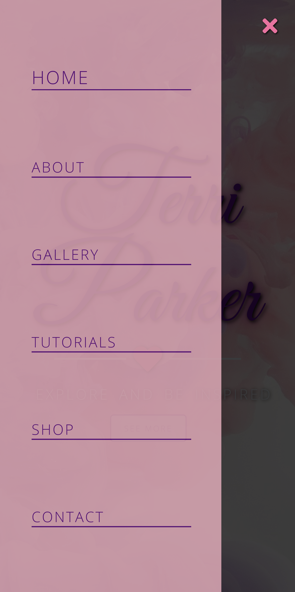
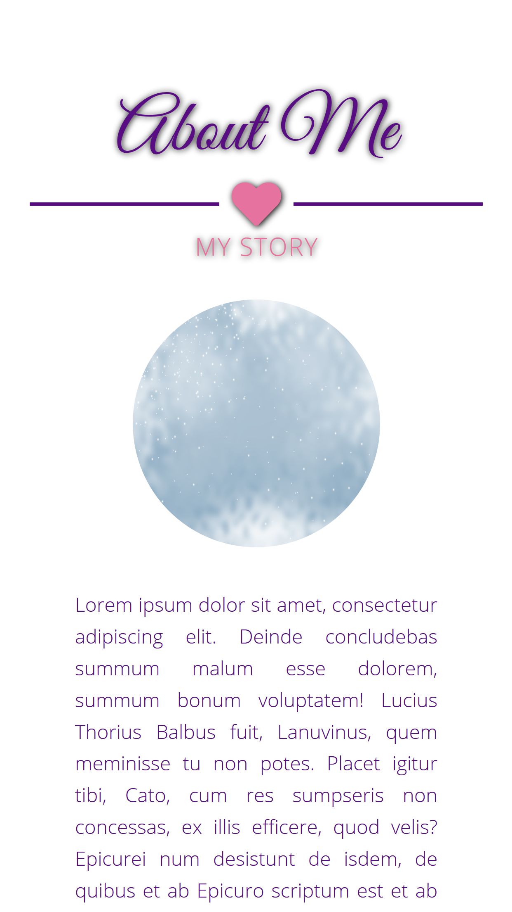
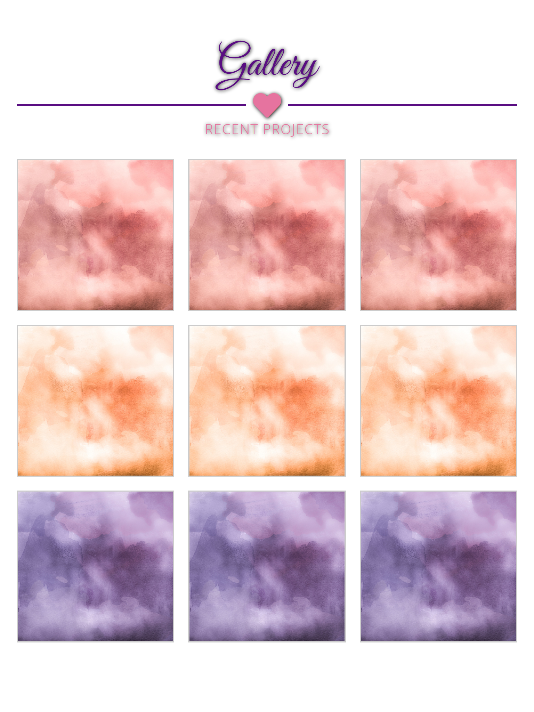
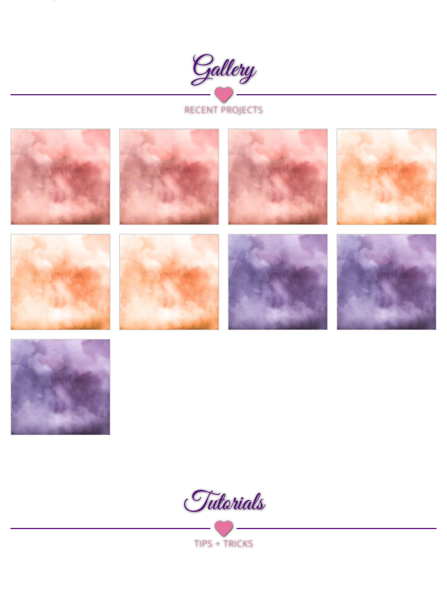

<!--
*** Markdown "reference style" links used for readability.
*** Reference links are enclosed in brackets [ ] instead of parentheses ( )
*** https://www.markdownguide.org/basic-syntax/#reference-style-links
-->

<!-- PROJECT SHIELDS -->

[![Contributors][contributors-shield]][contributors-url]
[![Forks][forks-shield]][forks-url]
[![Stargazers][stars-shield]][stars-url]
[![Issues][issues-shield]][issues-url]
[![MIT License][license-shield]][license-url]

<!-- PROJECT LOGO -->
 

  

  <h3 align="center">README</h3>

  
    
    <a href="https://github.com/BrettFlavin/Terri-Parker_Responsive-Website/issues">Report Bug</a>
    ·
    <a href="https://github.com/BrettFlavin/Terri-Parker_Responsive-Website/issues">Request Feature</a>
  

<!-- TABLE OF CONTENTS -->

## Table of Contents

- [About the Project](#about-the-project)
- [Built With](#built-with)
- [Usage](#usage)
- [Roadmap](#roadmap)
- [Contributing](#contributing)
- [License](#license)
- [Contact](#contact)
- [Acknowledgements](#acknowledgements)

<!-- ABOUT THE PROJECT -->

## About The Project

<!-- BUILT WITH -->

## Built With

This application was created w/ Visual Studio Code using HTML, CSS, and JavaScript.

- [Visual Studio Code](https://code.visualstudio.com/)

<!-- USAGE EXAMPLES -->

## Usage

Here are some example screenshots of the application running on various different devices:

Google Pixel 2 XL

Google Pixel 2 XL

Galaxy S9

iOS 11 Plus

iPad Mini

iPad Pro

<!-- ROADMAP -->

## Roadmap

See the [open issues](https://github.com/BrettFlavin/Terri-Parker_Responsive-Website/issues) for a list of proposed features (and known issues).

<!-- CONTRIBUTING -->

## Contributing

Contributions make the open source community an amazing place to learn, be inspired, and create. Any contributions you make are **greatly appreciated**.

1. Fork the Project
2. Create your Feature Branch (`git checkout -b feature/AmazingFeature`)
3. Commit your Changes (`git commit -m 'Adding some feature that is amazing!'`)
4. Push to the Branch (`git push origin feature/AmazingFeature`)
5. Open a Pull Request

<!-- LICENSE -->

## License

Distributed under the MIT License. See `LICENSE` for more information.

<!-- CONTACT -->

## Contact

Author:
 
Brett R. Flavin - brettflavin@yahoo.com

Project Link: [https://github.com/BrettFlavin/Terri-Parker_Responsive-Website](https://github.com/BrettFlavin/Terri-Parker_Responsive-Website)

<!-- ACKNOWLEDGEMENTS -->

## Acknowledgements

- [othneildrew - readme template](https://github.com/othneildrew/Best-README-Template)
- [Landing Page/Images](https://www.pexels.com/)

<!-- MARKDOWN LINKS & IMAGES -->
<!-- https://www.markdownguide.org/basic-syntax/#reference-style-links -->

[contributors-shield]: https://img.shields.io/github/contributors/BrettFlavin/Terri-Parker_Responsive-Website?style=plastic
[contributors-url]: https://github.com/BrettFlavin/Terri-Parker_Responsive-Website/graphs/contributors
[forks-shield]: https://img.shields.io/github/forks/BrettFlavin/Terri-Parker_Responsive-Website?style=plastic
[forks-url]: https://github.com/BrettFlavin/Terri-Parker_Responsive-Website/network/members
[stars-shield]: https://img.shields.io/github/stars/BrettFlavin/Terri-Parker_Responsive-Website?style=plastic
[stars-url]: https://github.com/BrettFlavin/Terri-Parker_Responsive-Website/stargazers
[issues-shield]: https://img.shields.io/github/issues/BrettFlavin/Terri-Parker_Responsive-Website?style=plastic
[issues-url]: https://github.com/BrettFlavin/Terri-Parker_Responsive-Website/issues
[license-shield]: https://img.shields.io/github/license/BrettFlavin/Terri-Parker_Responsive-Website.svg?style=plastic
[license-url]: https://github.com/BrettFlavin/Terri-Parker_Responsive-Website/LICENSE.txt
